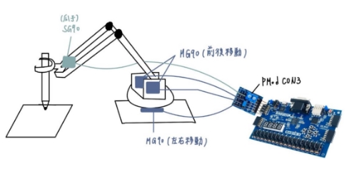
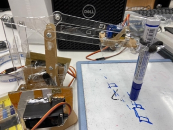
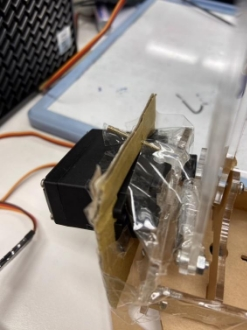

# FPGA Writing Machine
Collaborator: Jie En Tsai, Yi Chen Hsu

## 1. Design Concept

In this project, we aimed to create an arm capable of automatically writing numbers. Users can type numbers using a keyboard, which will be displayed on a 7-segment display. Up to four numbers can be input, with the backspace key used to delete the last number entered. Upon pressing the Enter key, the arm enters the WRITING state, accompanied by a short musical piece. In the WRITING state, the arm writes the numbers displayed on the 7-segment display and then returns to the IDLE state, playing another short tune.

The image below is our initial design concept. Later, we replaced the MG90S servo motors, which controlled the forward and backward movement of the arm, with MG995 motors. This will be elaborated in the subsequent sections.

### Hardware Mechanism

For the hardware, we purchased a pre-made acrylic template for the robotic arm and assembled it. There are four servos in the setup: one for controlling the claw's opening and closing, two for controlling the arm's forward, backward, and lifting movements, and one for controlling the base's left and right rotatio

- Expected

    Initially, we planned to use MG90 servos for lifting, moving forward, and rotating the arm. To cut costs, we intended to use SG90 servos at the claw joint, which required less precise control. When SW0 is pulled up, the front claw opens for the user to insert a pen, and when SW0 is down, the claw closes and grips the pen.
- Actual

    During implementation, we found that the MG90S servos lacked the torque to rotate the robotic arm. Therefore, we replaced the MG90S on both sides of the arm with MG995 servos. We made brackets from cardboard and purchased longer screws to accommodate our design changes. To save costs, we continued using the MG90S for the base. We discovered that allowing users to insert the pen could result in unstable writing due to height variations. Hence, we later chose to remove this feature and tied the pen directly to the arm to maintain a consistent height.  
          

    The following image shows our modified arm.  
        

### Software Architecture

**State Transition** 

- IDLE: Initialize all variables
- TYPING: Detect keyboard input of numbers
- WRITING: Control the angles of three servo motors for writing

**Keyboard & 7-Segment Display** 

In the TYPING State, numbers 0-9 can be entered via the keyboard and displayed on the 7-Segment Display, starting from the rightmost position. Each entry shifts left by one digit, and pressing *Backspace* moves right and deletes a digit. This part employs the KeyboardDecoder Module.

**LED** 

- `LED[15:12]`: Lights up in IDLE State
- `LED[11:8]`: Lights up in TYPING State
- `LED[7:4]`: Lights up in WRITING State
- `LED[3:0]`:  Binary corresponds to pen strokes
    The 0th stroke corresponds to 4’b0001, the 1st to 4’b0010, and so on.

**Audio** 

We used the I2S2 Pmod for the audio module. Pressing BTNR switches from IDLE State to TYPING State, triggering the Start BGM (Super Mario Theme Song). Pressing ENTER switches from TYPING State to WRITING State, playing the End BGM (Super Mario Level Complete BGM). 

**Servo Motor Mechanism**

We used the CON3 Pmod for the servo motor module, connecting it to an external 5V 2A transformer.

The MG90S servo motor, with a torque of 2 KG and a rotation angle of 180 degrees, controls the base's left-right movement. The mechanical arm's left and right arms, which control up-down (lifting) and forward-backward movement, require more torque. Hence, we used MG995 servo motors with a torque of 13 KG and a rotation angle of 180 degrees.

Both servo motors have a fresh rate of 20ms (50Hz), and the signal pulse corresponds to the following angles:

|Signal Pulse | Angle |
| - | - |
|0\.5ms |- 90° |
|1\.0ms |- 45° |
|1\.5ms |0° |
|2\.0ms |+ 45° |
|2\.5ms |+ 45° |

For motor PWM control, we referred to this [design.](https://www.instructables.com/Controlling-Servos-on-FPGA/) Due to variances in servo motor rotation, we tested and stored the required pen strokes and motor rotation angles in the following table, adjusting the corresponding PWM output (`value = (10'd944)*(angle) + 16'd60000`) for each.

|Stroke |Control Servo |Value |Control Direction |Degree |
| - | - | - | - | - |
|IDLE |Left, Right, Bottom |9'b00\_0000000 |Up/Down, Left/Right, Forward/Back |0° |
|LEFT |Bottom |9'b11\_0000101 |Left/Right |5° |
|RIGHT |Bottom |9'b11\_0000000 |Left/Right |0° |
|FRONT |Right |9'b10\_0001010 |Forward/Back |10° |
|MIDDLE |Right |9'b10\_0000101 |Forward/Back |5° |
|BACK |Right |9'b10\_0000000 |Forward/Back |5° |

**Number Writing Sequence**

In our implementation, we set the stroke sequence for each number based on the above table. Testing revealed that BACK is more stable than FRONT, and MIDDLE → FRONT is also more stable than directly using FRONT. Therefore, we modified the stroke sequence for FRONT to FRONT → BACK → FRONT or MIDDLE → FRONT (depending on the number of strokes), achieving a more stable writing effect. The writing sequence for each number is as follows:

|Number |Stroke Sequence ||
| - | - | :- |
|0 |FRONT BACK FRONT LEFT BACK RIGHT LEFT  ||
|1 |	FRONT BACK  ||
|2 |LEFT MIDDLE RIGHT FRONT LEFT   ||
|3 |LEFT RIGHT MIDDLE LEFT RIGHT FRONT LEFT  ||
|4 |FRONT BACK MIDDLE LEFT FRONT ||
|5 |LEFT RIGHT MIDDLE LEFT FRONT RIGHT ||
|6 |LEFT FRONT BACK RIGHT MIDDLE LEFT ||
|7 |FRONT BACK FRONT LEFT MIDDLE ||
|8 |MIDDLE LEFT FRONT RIGHT BACK LEFT MIDDLE ||
|9 |MIDDLE LEFT FRONT RIGHT BACK LEFT||

**Number Transition**

We start writing from the last number entered. When transitioning between numbers, we lift the pen (left arm angle_left rotates 8°) and move counterclockwise (base angle_bottom rotates 8°) to achieve a left-to-right writing effect.

Actual **demo** video：[**Link** ](https://drive.google.com/file/d/1KWQJy-cMV1YNXyIrAlhaxCEwerAAuEhq/view?usp=sharing)

## 2. Challenges and Solutions

### Insufficient Motor Torque

Initially, when using MG90S motors to rotate the arm, they could only turn successfully when a large PWM angle was sent; smaller angles had no response, thus failing to achieve the precision needed for writing. Initially suspected to be a voltage issue, the problem persisted even after using a 5V/2A transformer. After various attempts, we switched to MG995 motors, which enabled the control of smaller angles.  

### Incompatibility of Mechanical Arm Configuration and Modified Parts

After replacing the motors, the holes in the arm purchased online were no longer suitable. We made brackets from cardboard and bought longer screws to fit our mechanism. The heavier MG995 motors caused continuous damage and several breakages to the arm's acrylic material. We eventually reinforced it with hot glue and tape to prevent further breakage.

### Excessive Resistance

In our tests, using ballpoint pens resulted in incomplete numbers due to excessive friction with the paper. Thus, we switched to whiteboard markers and boards for experimentation. We also found that certain angles slightly lifted the pen, missing some strokes. We experimented multiple times to improve the stroke sequence, such as writing the easy-to-break strokes in two segments or writing back and forth twice.

## 3. Reflections and Discussion

This final project was particularly challenging for us, as we were not very familiar with electronic equipment. When the motors wouldn't turn, we spent a lot of time determining whether the issue was with the program, the motors, or the voltage. We spent many days in and out of the local electronics stores, spending more time in the electronics building than in our dorms.

The hardware mechanism posed a significant challenge. Initially, we faced numerous problems and difficulties, even doubting whether we could complete the project's full functionality. However, we did not give up. Instead, we continuously researched online, discussed with store owners, teaching assistants, and classmates. Finally, we managed to create the project we envisioned, which felt incredibly rewarding.
